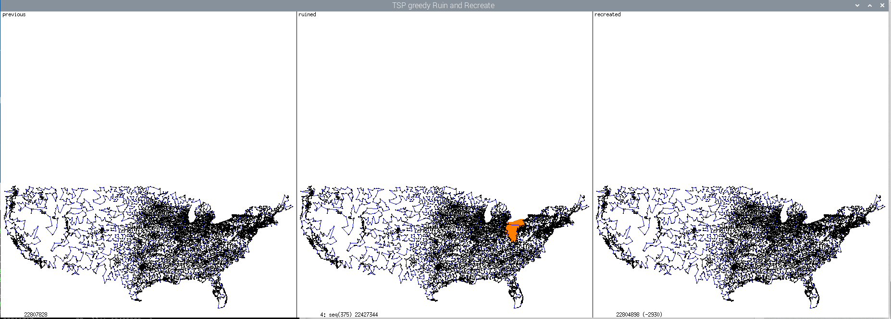
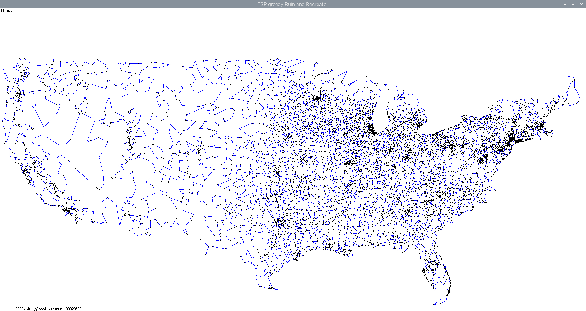
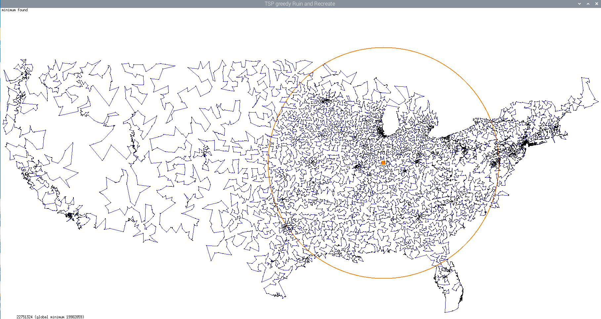
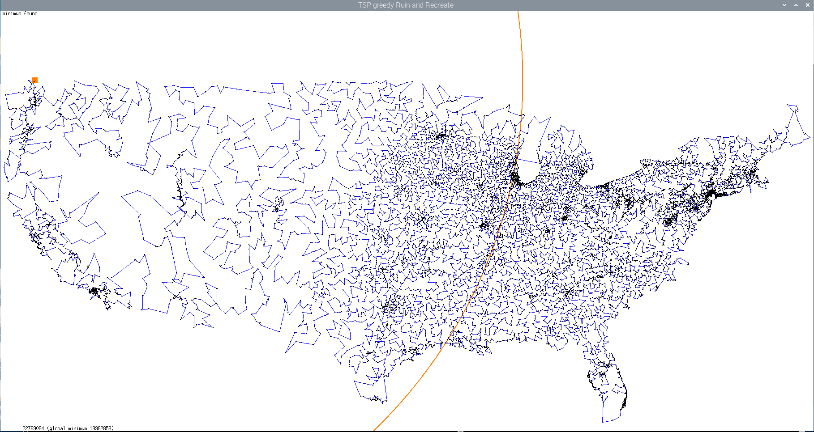

# TSP

## load_test demo
```
hermann@j4105:~/RR/tsp$ make load_test 
g++ -O3 -std=c++20  -Wall -Wextra -pedantic load_test.cpp -o load_test -lstdc++ -lm
hermann@j4105:~/RR/tsp$ 
hermann@j4105:~/RR/tsp$ ./load_test ../data/tsp/usa13509
2
490000,1.22264e+06
13509
-1
7930
19982885
hermann@j4105:~/RR/tsp$ 
```

## greedy

```
hermann@j4105:~/RR/tsp$ make greedy
g++ -O3 -std=c++20  -Wall -Wextra -pedantic greedy.cpp -o greedy -lstdc++ -lm
hermann@j4105:~/RR/tsp$ 
hermann@j4105:~/RR/tsp$ time ./greedy 205
50933           local minimum found (after 100,000 greedy mutations)
21896           ms (only recreate)
50778           global minimum

real	0m26,143s
user	0m26,086s
sys	0m0,015s
hermann@j4105:~/RR/tsp$ 
```

## validate

After lot of code cleanup, random seed 205 did result in another sequence of mutations. Since Apple botched radom/drand48, this was the time to switch to ```std::mt19937``` randon number generator:
```
hermann@j4105:~/RR/tsp$ make greedy
g++ -O3 -std=c++20  -Wall -Wextra -pedantic greedy.cpp -o greedy -lstdc++ -lm
hermann@j4105:~/RR/tsp$ ./greedy -s 205 ../data/tsp/pcb442
50778           global minimum
51708           local minimum found (100000 greedy mutations; seed=205)
24153           ms (only recreate)

hermann@j4105:~/RR/tsp$ 
```

New best optimization random seed for pcb442 100,000 mutations is now 670, resulting in tour of length 50,879 (global minimum 50,778). New file [nohup.out.norm.comp](nohup.out.norm.comp) is normalized nohup output for seed 670. Tool [validate](validate) creates same seed random output again, normalizes and does diff. Same sequence of mutations is done, if only the last line with microsecond duration output differs, like here (fast time was reported on AMD 7600X CPU):  
```
hermann@j4105:~/RR/tsp$ ./validate 
nohup: ignoring input and appending output to 'nohup.out'
93c93
< 23666           ms (only recreate)
---
> 5971           ms (only recreate)
hermann@j4105:~/RR/tsp$ 
```

There are 6 seed values up to 999 (69, 295, 783, 802, 922 and 967) all resulting in same minimal tour length 51,052. They all have a different amount of accepted greedy mutations.

## graphics display 
A lot of options have been added, including saving and loading of tours:  
```
pi@raspberrypi5:~/RR/tsp $ ./greedy -h
./greedy [-d] [-c] [-i tour_or_mode] [-h] [-m nmut] [-r] [-s seed] fname
  -d: single display
  -c: small city display
  -i: file.tour or radial_min/radial_max/radial_ran for RR_all()
  -h: this help
  -m: #mutations
  -r: rotate 270°
  -s: seed
pi@raspberrypi5:~/RR/tsp $ 
```

This creates the usual 3 tours display, "-r" rotates by 270°, "-c" for small cities, for 13,509 cities of US:  
```
pi@raspberrypi5:~/RR/tsp $ make ezxdisp
g++ -O3 -std=c++20  -Wall -Wextra -pedantic greedy.cpp -o greedy -lstdc++ -lm -Dezxdisp -lezx -lX11
pi@raspberrypi5:~/RR/tsp $ ./greedy -r -c ../data/tsp/usa13509
19982859           global minimum
0: 22884006           RR_all() [3401927us]
2: 22875528           ran(169) (109481us)          
3: 22807828           ran(1478) (841438us)          
4: 22804898           seq(9020,375) (224667us)          
```
Looks like this:  



Same command with "-d" option for single display (click on image for 1:1 display):  



Alternatively to random ```RR_all()```, the "-i" option allows to specify one of three "radial_..." modes for initial configuration creation. Below highlights the city with minimal sum of distances to all other cities. The circle radius is avarage distance of all cities to the chosen city. ```RR_all()``` inserts the cities not randomly in this mode, but in increasing distance from the determined city. Each city gets inserted with "best insert" as done with random ```RR_all()```:  
```
pi@raspberrypi5:~/RR/tsp $ ./greedy -m 0 -c -r -d -i radial_min ../data/tsp/usa13509
```


Just for comparison, here the picture for ```radial_max```:  
```
pi@raspberrypi5:~/RR/tsp $ ./greedy -m 0 -c -r -d -i radial_max ../data/tsp/usa13509
```


Both initial tour lengths are roughly the same, and the same as a typical random ```RR_all()``` tour length.

